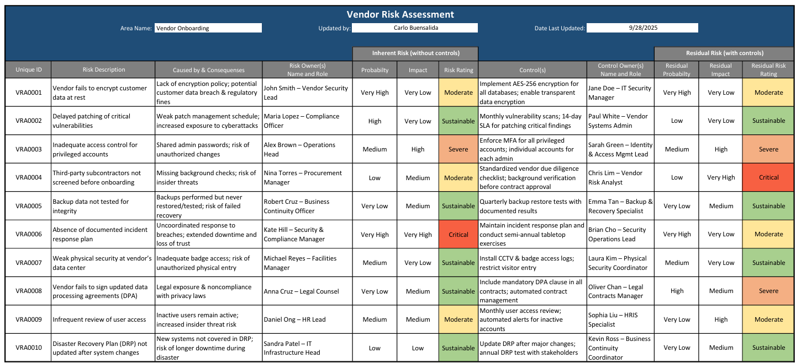

****
# Vendor-Risk-Assessment-Matrix
A dynamic Excel tool for assessing and visualizing vendor risk levels in seconds 

---

## 🔑 Key Features  

- **Automated Risk Rating** – Select the **Probability** and **Impact** of a risk from drop-down lists, and the sheet instantly returns the correct **Risk Rating** (e.g., “Moderate,” “Critical,” “Sustainable”).  
- **Built-in Visualization & Counting** – A dynamic risk matrix automatically counts and displays how many risks fall into each category at a glance.  
- **Inherent & Residual Risk Tracking** – See both your starting (inherent) risk and what remains after controls (residual risk) side by side.  
- **Flexible Risk Categories** – Sustainable, Moderate, Severe, and Critical risks are pre-defined, but you can easily change labels or scales in the matrix and the entire sheet updates automatically.  
- **Master Probability & Impact Matrix** – Everything feeds from one master matrix so updates are seamless and consistent across the sheet.  

---

## 🛠️ How It Works  

- **INDEX & MATCH** formulas compare the selected Probability and Impact to return the correct Risk Rating from the master matrix.  
- **COUNTIFS** formulas tally how many risks you have per category for quick visual dashboards (for both inherent and residual risks).  
- **Heatmaps** display risk levels clearly, highlighting areas needing attention.  

---

## 🚀 Why It Matters  

This tool streamlines vendor risk assessments, saves time, and improves accuracy by reducing manual scoring.  
It’s perfect for GRC, vendor management, or any role where risks need to be evaluated consistently and quickly.  

---

## 📬 Feedback Welcome  

I’m open to **suggestions and recommendations** to improve this project — and also open to **ideas for my third project** as I continue building my GRC portfolio.  

---

⭐ **If you find this project useful, please star the repo to show support!**  

---
